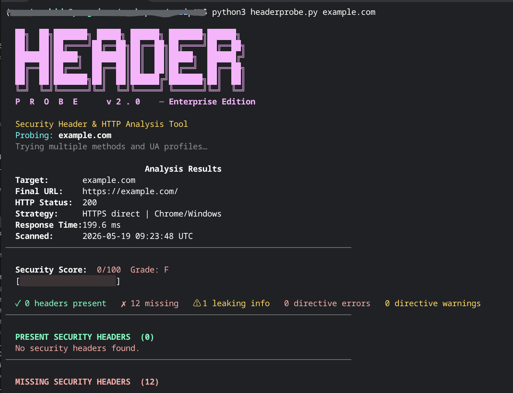

# HeaderProbe v2.0



A Python CLI tool for analyzing HTTP security headers. It checks for missing headers, validates their directives, inspects cookies, and can also probe TLS certificates and HTTP methods. Useful for developers and security researchers auditing sites they own or have permission to test.

---

## What it does

### Security header analysis
Detects present, missing, and deprecated headers. Goes further than just checking if a header exists — it reads the values and flags invalid or misconfigured directives. Also detects headers that expose server information unnecessarily.

### Directive validation

| Header | What gets validated |
|---|---|
| `Strict-Transport-Security` | Non-integer `max-age`, age under 1 day, missing `includeSubDomains`, `preload` without `includeSubDomains`, unknown directives |
| `Content-Security-Policy` | Unknown or duplicate directives, `unsafe-inline`, `unsafe-eval`, wildcard sources, malformed nonces/hashes, missing `base-uri` and `object-src`, deprecated directives |
| `X-Frame-Options` | Deprecated `ALLOWFROM`, any value other than `DENY` or `SAMEORIGIN` |
| `Referrer-Policy` | Invalid values, weak values like `unsafe-url` |
| `Permissions-Policy` | Malformed `feature=allowlist` syntax, unknown features, wildcard grants |
| `Cache-Control` | Directives that wrongly carry values (e.g. `no-store=0`), non-integer `max-age`, duplicate directives |
| `X-XSS-Protection` | Outdated `1; mode=block` with an explanation of what to use instead |
| `Cross-Origin-Opener-Policy` | Invalid values, weak `unsafe-none` |
| `Cross-Origin-Embedder-Policy` | Invalid values, weak `unsafe-none` |
| `Cross-Origin-Resource-Policy` | Invalid values, risky `cross-origin` |

### Cookie security
Checks `Secure`, `HttpOnly`, and `SameSite` flags. Collects cookies from every step in the redirect chain, not just the final response. Flags `SameSite=None` without `Secure`, missing explicit `SameSite` declarations, and unknown cookie directives.

### HTTP probing
Tries multiple connection strategies automatically: HTTPS, HTTPS without SSL verification, HTTP, and the `www.` variant. Uses realistic browser headers so servers that filter basic script requests respond normally. Reports response time in milliseconds.

### TLS certificate inspection (`--ssl`)
Shows the subject, issuer, expiry date, days until expiry, TLS protocol version, cipher suite, and all Subject Alternative Names.

### HTTP method probing (`--methods`)
Tests GET, POST, HEAD, OPTIONS, PUT, DELETE, PATCH, and TRACE. Flags methods that are enabled but should be blocked.

### Other features
- DNS resolution for IPv4 and IPv6 (`--dns`)
- Scan multiple domains at once and get a comparison table (`--compare`)
- Full JSON report output for scripting or logging (`--json`)

---

## Requirements

```bash
pip install requests
```

Python 3.8 or later. No other dependencies.

---

## Usage

```bash
# Basic scan
python3 headerprobe.py example.com

# All probes enabled
python3 headerprobe.py example.com --ssl --dns --methods --verbose

# Compare multiple targets
python3 headerprobe.py --compare site1.com site2.com site3.com

# JSON output
python3 headerprobe.py example.com --json > report.json

# No color, useful for saving output to a file
python3 headerprobe.py example.com --no-color | tee scan.txt

# Run without arguments to be prompted for a domain
python3 headerprobe.py
```

---

## Flags

| Flag | Short | Description |
|---|---|---|
| `--ssl` | `-s` | Inspect the TLS certificate |
| `--dns` | `-d` | Resolve A and AAAA DNS records |
| `--methods` | `-m` | Probe HTTP methods and flag dangerous ones |
| `--verbose` | `-v` | Show extra notes on directive checks |
| `--show-all-headers` | | Print all raw response headers |
| `--json` | | Output the full report as JSON |
| `--compare` | | Scan multiple targets and compare scores |
| `--timeout` | `-t` | Request timeout in seconds (default: 12) |
| `--no-color` | | Disable ANSI colors |

---

## Scoring

Each present header earns points based on severity: HIGH = 30, MEDIUM = 15, LOW = 5. Penalties are applied for information-leaking headers (-5 each), directive errors (-3 each), and deprecated headers (-2 each).

| Score | Grade |
|---|---|
| 90-100 | A+ |
| 80-89 | A |
| 70-79 | B+ |
| 60-69 | B |
| 50-59 | C |
| 40-49 | D |
| Below 40 | F |

---

## Note on cookie detection

HeaderProbe checks cookies at the HTTP level, including cookies set during redirects. Cookies set by JavaScript after the page loads are not visible at the HTTP level and cannot be detected by any HTTP-based tool.

---

## Ethical use

Only use HeaderProbe on domains you own or have explicit written permission to test.

---

## License

MIT
